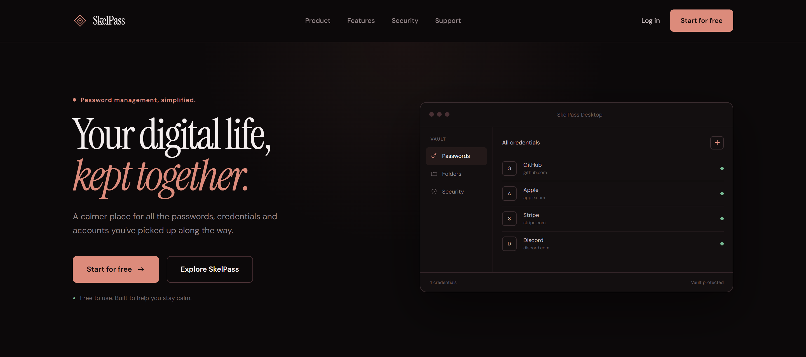

<p align="center">
  
</p>

### SkelPass 🔒

SkelPass is a calm password manager that lets you keep your passwords,
account details in one secure vault.

This project is built with **Next.js (App Router)** and **MongoDB**.

#### 🚀 Features

- Sign up / log in with email + master password (bcrypt-hashed)
- JWT-based session management with HttpOnly cookies (edge-compatible via `jose`)
- Every password in the vault is encrypted server-side, field by field, with
  **AES-256-GCM**
- Add / edit / delete / favorite passwords
- Fully user-managed folders: create, rename, and delete folders from the
  sidebar; deleting a folder never deletes its passwords — they simply
  become uncategorized
- Account settings page: edit name/email, upload and crop a profile photo,
  change your master password
- Active session management: every login is tracked in the database with
  device, browser, and IP info; view all signed-in devices from account
  settings and revoke any of them individually, or sign out everywhere
  else with one click — revoked sessions are kicked out in real time
- Search, vault health score, secure password generator
- `middleware.ts` protects the `/dashboard` route (and everything under it)

#### 📋 Project Structure

```
app/
  page.tsx                          Landing page
  page.module.css
  login/page.tsx                    Login page
  register/page.tsx                 Register page
  dashboard/
    layout.tsx                      Shared shell (Sidebar + Topbar) for /dashboard/*
    DashboardContext.tsx            Client-side state shared across dashboard pages (polls session validity)
    page.tsx                        Vault view (protected)
    Dashboard.module.css
    account/
      page.tsx                      Account settings (profile photo, name/email, password, active sessions)
      Account.module.css
  api/
    auth/register/route.ts
    auth/login/route.ts
    auth/logout/route.ts            POST — clears cookie + revokes the current DB session
    auth/me/route.ts
    auth/profile/route.ts           PATCH — update name/email/avatar
    auth/password/route.ts          PATCH — change master password
    auth/sessions/route.ts          GET (list active sessions) / DELETE (revoke all but current)
    auth/sessions/[id]/route.ts     DELETE — revoke a single session
    vault/route.ts                  GET (list) / POST (create)
    vault/[id]/route.ts             GET / PATCH / DELETE
    vault/generate/route.ts         Secure password generator
    folders/route.ts                GET (list) / POST (create)
    folders/[id]/route.ts           PATCH (rename) / DELETE
components/
  Product/Product.tsx               A single vault entry card (+ .module.css)
  Sidebar/Sidebar.tsx               Vault nav, folder management, account link
  Topbar/Topbar.tsx                 Search + mobile menu
  VaultModal/VaultModal.tsx         Add/edit password modal
  Nav/Nav.tsx                       Landing page navigation
  Footer/Footer.tsx
  AuthLayout/AuthLayout.tsx         Shared Login/Register shell
  PasswordField/PasswordField.tsx
  IconSprite/IconSprite.tsx         Shared SVG icon set
lib/
  mongodb.ts                        MongoDB connection singleton (users, vault, folders, sessions)
  auth.ts                           JWT session helpers, DB-backed session management, fresh profile lookup
  crypto.ts                         AES-256-GCM encryption helpers
  types.ts                          Shared TypeScript types (camelCase fields, incl. SessionDocument/SessionDto)
middleware.ts                       Protects the /dashboard route (JWT signature check only; DB-backed revocation is enforced in getCurrentSession() on the server)
```

#### 🚀 Setup

1. Install dependencies:

   ```bash
   npm install
   ```

2. Copy `.env.example` to `.env.local` and fill in the values:

   ```bash
   cp .env.example .env.local
   ```

   - `MONGODB_URI` — your MongoDB connection string (local or MongoDB Atlas)
   - `MONGODB_DB` — database name (default: `skelpass`)
   - `JWT_SECRET` — session signing secret. Generate one with:
     ```bash
     openssl rand -base64 48
     ```
   - `ENCRYPTION_KEY` — a base64-encoded, 32-byte AES key used to encrypt
     vault passwords. Generate one with:
     ```bash
     openssl rand -base64 32
     ```

   > ⚠️ If you lose or rotate `ENCRYPTION_KEY`, every password saved up to
   > that point becomes undecryptable. Keep this key somewhere safe (e.g. a
   > secrets manager).

3. Start the development server:

   ```bash
   npm run dev
   ```

   The app runs at http://localhost:3000 by default.

#### 📦 Database Collections

MongoDB is schemaless, so no separate migration step is required —
collections are created automatically on first write.

- **users**: `name`, `email`, `passwordHash`, `avatarDataUrl`, `createdAt`,
  `updatedAt`
- **vaultItems**: `userId`, `service`, `website`, `username`,
  `passwordEncrypted` ({ `iv`, `content`, `tag` }), `passwordStrength`,
  `folder` (folder name, or `null` if uncategorized), `favorite`,
  `createdAt`, `updatedAt`
- **folders**: `userId`, `name`, `createdAt`. Four starter folders (Work,
  Personal, Development, Finance) are seeded for every new account and can
  be renamed or deleted freely afterwards.

For performance, you may optionally create these indexes:

```js
db.users.createIndex({ email: 1 }, { unique: true });
db.vaultItems.createIndex({ userId: 1, updatedAt: -1 });
db.folders.createIndex({ userId: 1, name: 1 });
```

#### 🔧 Deploying (Vercel Recommended)

1. Push this repo to a Git provider (GitHub/GitLab).
2. Import the project on [Vercel](https://vercel.com).
3. Add the following environment variables in the project settings:
   `MONGODB_URI`, `MONGODB_DB`, `JWT_SECRET`, `ENCRYPTION_KEY`.
4. A managed service like [MongoDB Atlas](https://www.mongodb.com/atlas) is
   recommended. To let Vercel's serverless functions reach your Atlas
   cluster, allow `0.0.0.0/0` (or Vercel's IP ranges) under Atlas Network
   Access.
5. Deploy. Vercel automatically runs `next build`.

Alternatively, you can run it on any Node.js-capable server:

```bash
npm run build
npm run start
```

#### 🔒 Security Notes

- Master passwords are never stored in plain text; they're hashed with
  `bcrypt` (cost factor 12).
- Every password field in the vault is individually encrypted with
  AES-256-GCM using `ENCRYPTION_KEY`.
- The session token (JWT) is stored in an `HttpOnly`, `SameSite=Lax`
  cookie, sent with the `Secure` flag in production
  (`NODE_ENV=production`). When "Remember me" is unchecked at login, the
  cookie is set as a session cookie that expires when the browser closes.
- Every API route verifies the requester's session, and users can only
  ever access records tied to their own `userId`.

#### 📄 License

MIT — See [LICENSE](./LICENSE.txt).
